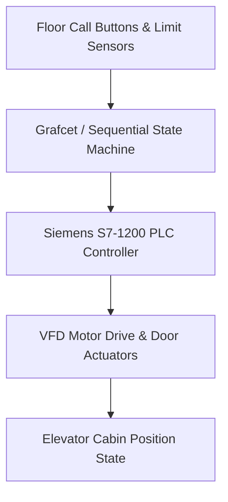

# Siemens PLC Sequential Elevator Controller

---

## 📌 Project Overview

Sequential elevator control system programmed and simulated using Siemens PLC automation logic (Ladder Diagram, Grafcet, STL). Features multi-floor request handling and safety interlocking.

This project is an engineering module built by **DJIDEL Abdelali Rayan** (Systems & Automation Engineer, USTHB).

---

## 🏗️ System Architecture & Data Flow

---

## 🛠️ Key Technologies & Frameworks

- **Siemens PLC**
- **Ladder Diagram**
- **Grafcet**
- **STL Logic**
- **Industrial Automation**

---

## 🚀 Live Interactive Web Demo

No installation required! Test and interact with the full web simulation live in your browser:
🔗 **[Launch Interactive Web Demo](https://djidelabdelali.github.io/siemens-plc-elevator-control/)**

---

## 🔗 Connected Portfolio Ecosystem

- 🌐 **Main Portfolio**: [djidelabdelali.github.io/portfolio](https://djidelabdelali.github.io/portfolio/)
- 💻 **GitHub Profile**: [github.com/DjidelAbdelali](https://github.com/DjidelAbdelali)
- 💼 **LinkedIn Profile**: [DJIDEL Abdelali Rayan](https://linkedin.com/in/djidel-abdelali-rayan-814b25207)

---

  Developed by DJIDEL Abdelali Rayan — Systems & Automation Engineering

